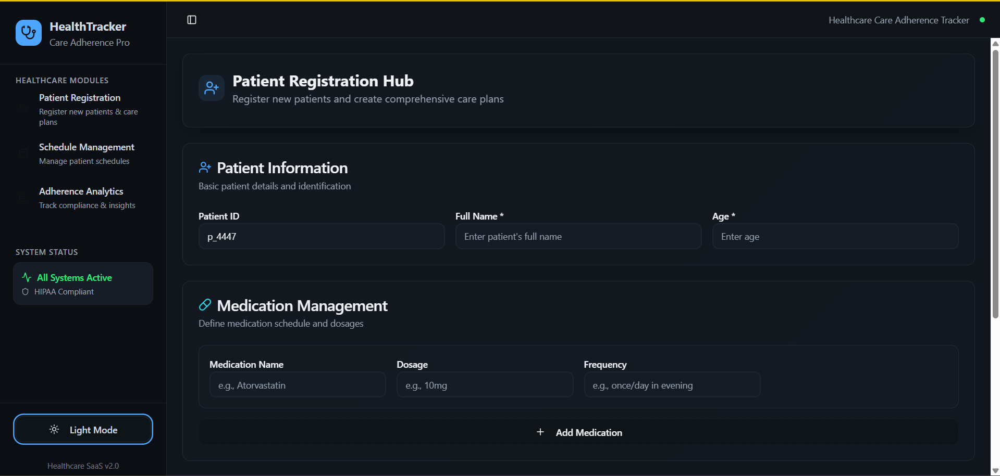
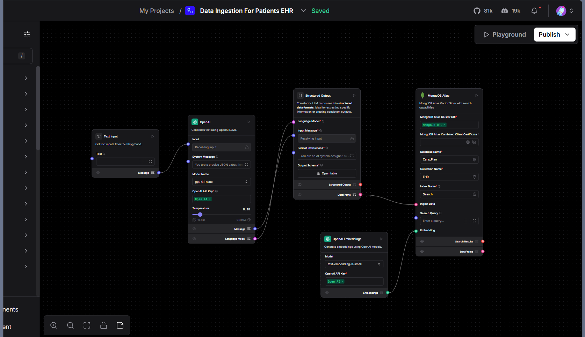
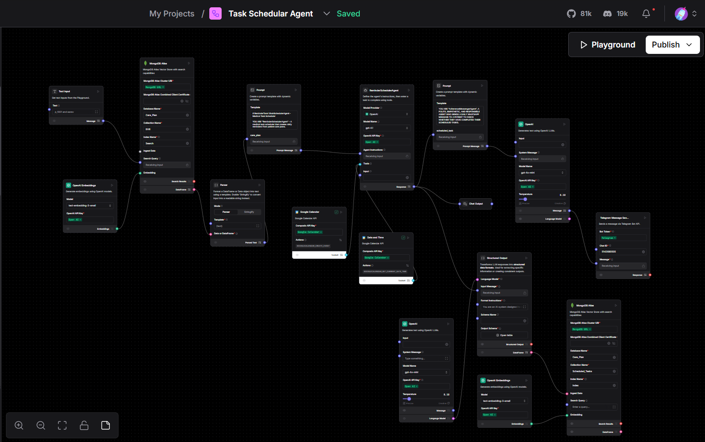
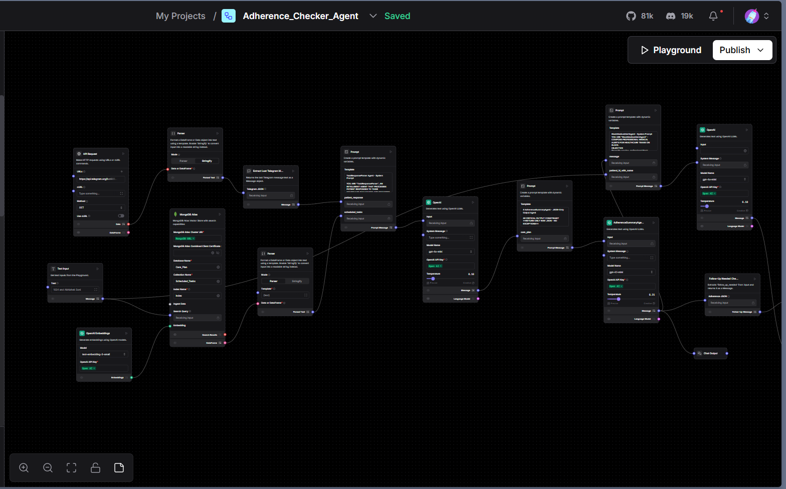

# 💙 CareSync AI — Smart Healthcare Agent Suite

A multi-agent healthcare automation platform built with Langflow and React. It streamlines patient registration, automates care plan adherence tracking, intelligently schedules daily tasks, and integrates structured patient data into EHR systems.

### **🌐 Deployed Agent UI:** [Deployed on Vercel but sorry can't share it publicly](https://your-deployed-app-url.com)

---

## 🧠 Project Overview

CareSync AI brings together three core Langflow agents powered by GPT-4o-mini and custom logic:

1. **📥 Data Ingestion Agent** – Extracts structured patient care data from free-form inputs into clean JSON for EHR ingestion.
2. **📅 Task Scheduler Agent** – Generates personalized daily care tasks using patient care plans and intelligently syncs with calendars.
3. **📊 Adherence Checker Agent** – Calculates patient adherence from task responses, flags non-compliance, and suggests follow-up.

All agents are backed by a beautiful and intuitive React + Tailwind CSS frontend for seamless healthcare workflow management.

---

## 🚀 Demo Screenshots

### 🔹 UI Dashboard (React + Tailwind)



### 🔹 Langflow – Data Ingestion Agent



### 🔹 Langflow – Task Scheduler Agent



### 🔹 Langflow – Adherence Checker Agent

## 

## 🧱 Tech Stack

| Layer            | Tools Used                                                               |
| ---------------- | ------------------------------------------------------------------------ |
| 🧠 AI Workflows  | [Langflow](https://langflow.org), OpenAI GPT-4o-mini, Prompt Engineering |
| 🌐 Frontend      | React, TypeScript, Tailwind CSS, Shadcn UI                               |
| 📊 Data Handling | MongoDB Atlas, OpenAI Embeddings, Structured Output                      |
| 🔌 APIs          | Telegram Bot API, Langflow REST API                                      |
| 🛠 Dev Tools      | Vite, ESLint, PostCSS, GitHub                                            |

---

## 🧩 System Architecture

```
[User Input] ➝ Langflow Agents ➝ JSON Structuring ➝ MongoDB + EHR ➝ Task Scheduler ➝ Adherence Evaluator ➝ UI
```

- Each agent is modular and independently callable
- MongoDB stores all care plans and task execution logs
- Telegram integration allows patient-side task confirmations
- React UI allows real-time registration, tracking, and analytics

---

## 🧪 Modules & Workflows

### 1. 📥 **Data Ingestion Agent**

- Takes raw patient text (e.g. care plans, notes)
- Converts to structured JSON
- Stores in MongoDB `Care_Plan` → `EHR` collection

### 2. 📅 **Task Scheduler Agent**

- Searches for care plan
- Uses Langflow + Prompt templates to convert into actionable tasks
- Adds tasks to DB & sends updates via Telegram

### 3. 📊 **Adherence Checker Agent**

- Collects daily responses
- Flags non-adherence and low adherence rates
- Returns clean JSON (`adherence_rate`, `non_adherence_flag`, `follow_up_needed`)

---

## 🖥️ UI Functionality

- **Patient Registration Hub** – Capture ID, name, age, medications , exercise
- **Schedule Management** – Assign routines & medication timing
- **Adherence Analytics** – Track patient progress visually

---

## 📁 Folder Structure (Frontend)

```
/public
/src
├─ components
│ └─ ui/
├─ hooks/
├─ lib/
├─ App.tsx
├─ main.tsx
├─ index.css
tailwind.config.ts
package.json
vite.config.ts
```

---

## 📦 Setup Instructions

### 🛠 Prerequisites

- Node.js v18+
- npm
- MongoDB Atlas cluster
- OpenAI API Key

### 🧪 Run Frontend Locally

```bash
git clone https://github.com/yashusinghal69/Care-Plan-Adherence-Agent.git
cd  Care-Plan-Adherence-Agent
npm install
npm run dev
```

### 🌐 Deploy Langflow Agents

Use Docker or Langflow Cloud
Each flow can be triggered via:

```bash
POST /api/v1/run/:secret_flow_id
```

---

## 🐳 Quick Start with Docker

The easiest way to deploy this application is using Docker. This eliminates the need for local Node.js setup and handles all dependencies automatically.

### Prerequisites

- Docker and Docker Compose installed
- Your Langflow API credentials

### 🚀 One-Click Setup

**For Windows:**

```bash
./start-docker.bat
```

**For Linux/Mac:**

```bash
chmod +x start-docker.sh
./start-docker.sh
```

### Manual Docker Setup

1. **Clone and Configure:**

```bash
git clone <your-repo-url>
cd Care-Plan-Adherence-Agent

# Copy environment template
cp .env.template .env
```

2. **Edit `.env` file with your Langflow configuration:**

```env
VITE_BASE_DEPLOYED_URL=https://your-langflow-instance.com/api/v1/run
VITE_LANGFLOW_FLOW_ADHERENCE_ID=your-adherence-flow-id
VITE_LANGFLOW_REGISTRATION_ID=your-registration-flow-id
VITE_LANGFLOW_FLOW_SCHEDULER_ID=your-scheduler-flow-id
```

3. **Build and Run:**

```bash
# Using Docker Compose (recommended)
docker-compose up --build

# Or using Docker directly
docker build -t care-plan-agent .
docker run -p 3000:3000 --env-file .env care-plan-agent
```

4. **Access the Application:**

- Frontend: http://localhost:3000/agents/patient-care-agent/
- Health Check: http://localhost:3000/health

### Production Deployment with Nginx

For production, use the nginx profile:

```bash
docker-compose --profile production up --build
```

This will serve the application through Nginx with:

- Gzip compression
- Security headers
- Static asset caching
- Load balancing ready

---
